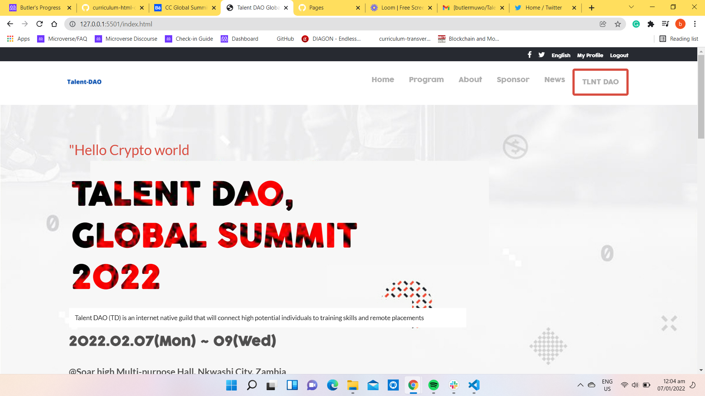
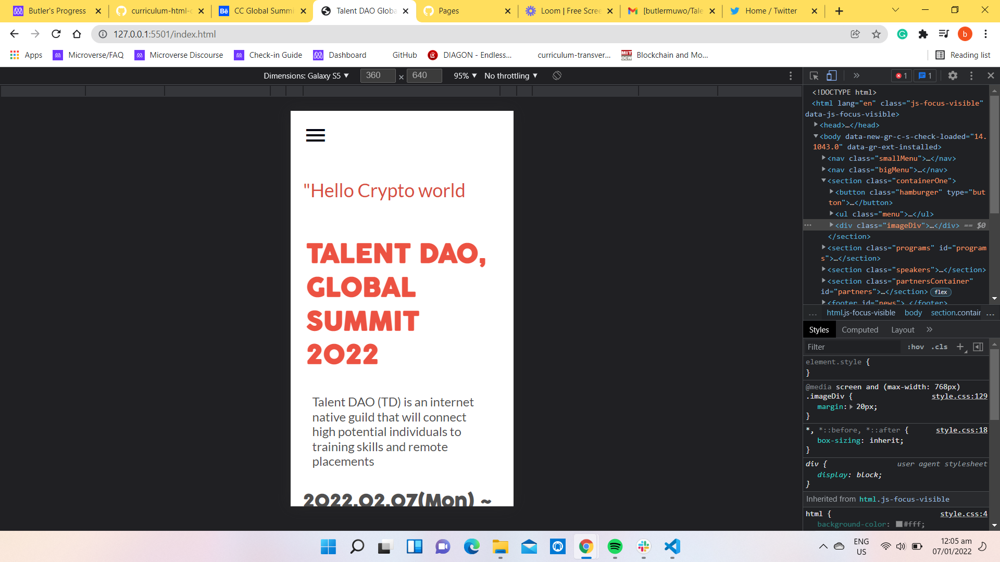

# TalentDAO


# TALENT-DAO-GLOBAL SUMMIT WEB PAGE

> Building my first Capstone project to apply the concepts learned in order to enhance my skills in HTML, CSS & JavaScript.





Additional description about the project and its features.

## Built With

- HTML
- JavaScript
- CSS

## Live Demo

[Live Demo Link](https://butlermuwo.github.io/TalentDAO/)

## Demo Video Link

[Watch Demo](https://www.loom.com/share/355c3125f7764318bd606f9b2330eb8d)

## Getting Started

**To get a copy of this repo into your local machine run the following command:**

```
To get a local copy up and running follow these simple example steps.

-Clone this repository with

git clone https://github.com/butlermuwo/TalentDAO.git using your terminal or command line.

-Change to the project directory by entering :

cd TalentDAO in the terminal.

-run code . to open it in vscode

It is a website and It can be opened in any browser.

It is responsive to different screen sizes.

I have put a live demo link below in the following section so that if anyone is interested can view it. However, if anyone would like to use it, simply, they can fork the repository and then use it independently. There are no other dependencies or installations required.
```

## Author

👤 **Butler Shimaluwani**

- GitHub: [@butlermuwo](https://github.com/butlermuwo)

## 🤝 Contributing

Contributions, issues, and feature requests are welcome!
Feel free to check the [issues page](../../issues/).

## Show your support

Give a ⭐️ if you like this project!

## Acknowledgments

- Original design idea by
  [Cindy Shin in Behance](https://www.behance.net/adagio07)

## 📝 License

This project is [MIT](./MIT.md) licensed.
